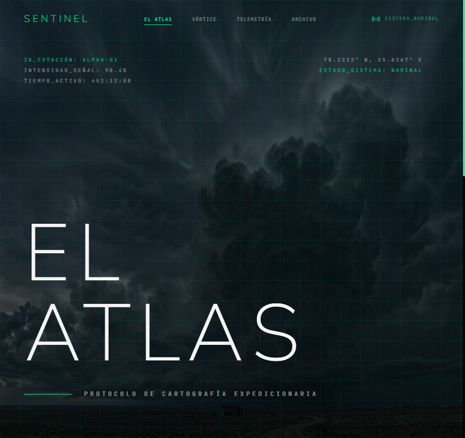

# SENTINEL

[](https://react.dev)
[](https://vite.dev)
[](https://tailwindcss.com)
[](https://gsap.com)

> Estación ficticia de investigación atmosférica extrema. Cuatro dominios, un fenómeno: el Relámpago del Catatumbo.



**[Ver el sitio →](https://storm-sentinel.vercel.app/)**

SENTINEL se presenta como el puesto de observación de un fenómeno real: la tormenta permanente sobre la cuenca del Lago de Maracaibo, 1,6 millones de voltios cada noche. La interfaz imita una consola de telemetría —coordenadas, intensidad de señal, tiempo activo— sobre fondos de video de tormenta.

## Los cuatro dominios

| Ruta | Sección | Contenido |
|---|---|---|
| `/` | **El Atlas** | Protocolo de cartografía expedicionaria |
| `/vortice` | **Vórtice** | Seguimiento del Relámpago del Catatumbo |
| `/telemetria` | **Telemetría** | Paneles de datos y mapas topográficos |
| `/archivo` | **Archivo** | Registro histórico |

## Características

- **Paleta cyber-noir**: verde neón `#00FFA3` sobre `#030408`, con grilla técnica de fondo y tipografía monoespaciada para los datos.
- **Video de fondo**: `storm-video.mp4` corre detrás del hero, con la capa de datos superpuesta.
- **Navegación con estado sincronizado**: la barra superior marca el dominio activo en las cuatro rutas.
- **Scroll y animación centralizados**: `useScrollEffects` es el único lugar donde viven Lenis y GSAP ScrollTrigger.

> [!IMPORTANT]
> En una SPA, Lenis y ScrollTrigger sobreviven al cambio de ruta y dejan triggers colgados que rompen las animaciones de la página siguiente. `useScrollEffects` destruye la instancia de Lenis y mata todos los ScrollTrigger en cada navegación antes de volver a crearlos. Si agregás una ruta nueva, pasá por ahí.

## Estructura

```
index.html                     Punto de entrada de Vite
src/main.jsx                   Montaje de React
src/App.jsx                    BrowserRouter y las cuatro rutas
src/pages/                     Atlas · Vortice · Telemetria · Archivo
src/components/                Navbar · Footer
src/hooks/useScrollEffects.js  Lenis + ScrollTrigger, con limpieza por ruta
public/                        storm-video.mp4 · telemetry.png · thunder.png
tailwind.config.js             Tokens de color y capas
```

## Cómo correrlo

Requiere Node 18 o superior.

```bash
git clone https://github.com/SimonOcampo1/storm-website.git
cd storm-website
npm install
npm run dev
```

El sitio queda en `http://localhost:5173`.

| Comando | Qué hace |
|---|---|
| `npm run dev` | Servidor de desarrollo con HMR |
| `npm run build` | Build de producción en `dist/` |
| `npm run preview` | Sirve el build para verificarlo |
| `npm run lint` | ESLint sobre todo el proyecto |
