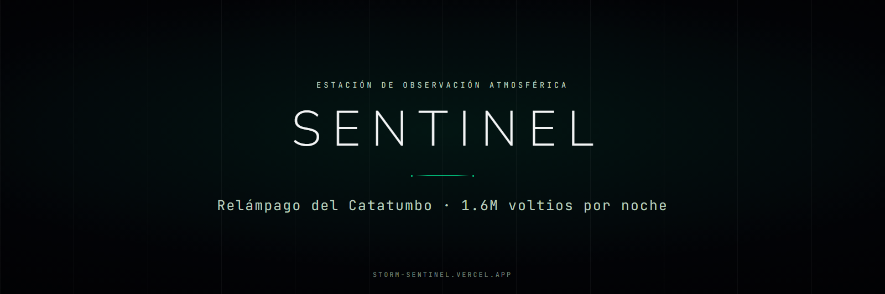

<p align="center">
  
</p>

<p align="center">
  
  
  
  
  
</p>

<p align="center">
  <a href="https://storm-sentinel.vercel.app/"><b>Ver el sitio</b></a> &nbsp;•&nbsp;
  <a href="#los-cuatro-dominios">Dominios</a> &nbsp;•&nbsp;
  <a href="#características">Características</a> &nbsp;•&nbsp;
  <a href="#stack">Stack</a> &nbsp;•&nbsp;
  <a href="#estructura">Estructura</a> &nbsp;•&nbsp;
  <a href="#puesta-en-marcha">Puesta en marcha</a>
</p>

SENTINEL es una estación ficticia de investigación atmosférica montada sobre un fenómeno real: el Relámpago del Catatumbo, la tormenta permanente de la cuenca del Lago de Maracaibo, 1,6 millones de voltios cada noche. El sitio no cuenta el fenómeno, lo monitorea: la interfaz imita una consola de telemetría —coordenadas, intensidad de señal, tiempo activo— sobre fondos de video de tormenta.

## Los cuatro dominios

| Ruta | Sección | Contenido |
|---|---|---|
| `/` | **El Atlas** | Protocolo de cartografía expedicionaria |
| `/vortice` | **Vórtice** | Seguimiento del Relámpago del Catatumbo |
| `/telemetria` | **Telemetría** | Paneles de datos y mapas topográficos |
| `/archivo` | **Archivo** | Registro histórico |

## Características

- **Estética cyber-noir.** Verde neón `#00FFA3` sobre `#030408`, grilla técnica de fondo, viñeta cinematográfica y tipografía monoespaciada para todo lo que sea dato.
- **Video de fondo en el hero.** `storm-video.mp4` corre detrás de la capa de datos, con animaciones de tormenta en CSS por encima.
- **Navegación con estado sincronizado**: la barra superior marca el dominio activo en las cuatro rutas.
- **Scroll y animación en un solo lugar.** `useScrollEffects` es el único módulo donde viven Lenis y ScrollTrigger; las páginas solo marcan elementos con `.gsap-fade-in` o `.gsap-slide-up`.

## Stack

| Capa | Tecnología | Por qué |
|---|---|---|
| UI | React 18 | Cuatro rutas que comparten navbar, footer y capa de telemetría: los componentes evitan repetir el chrome cuatro veces |
| Build | Vite 5 | HMR inmediato, que es lo que hace tolerable ajustar timings de animación |
| Rutas | React Router 6 | `BrowserRouter` con las cuatro secciones; el estado activo de la navbar sale de la ruta |
| Estilos | Tailwind CSS 3 | Paleta y radios (todos en `0px`) declarados como tokens, aplicados desde el marcado |
| Animación | GSAP + ScrollTrigger + Lenis | Timeline real sobre scroll suave, con un ciclo único de `gsap.ticker` |

## Estructura

```
index.html                     Punto de entrada de Vite
src/main.jsx                   Montaje de React
src/App.jsx                    BrowserRouter y las cuatro rutas
src/pages/                     Atlas · Vortice · Telemetria · Archivo
src/components/                Navbar · Footer
src/hooks/useScrollEffects.js  Lenis + ScrollTrigger, con limpieza por ruta
src/index.css                  Fuentes, grilla, viñeta y animaciones de tormenta
public/                        storm-video.mp4 · telemetry.png · thunder.png
tailwind.config.js             Tokens de color y tipografía
```

## Puesta en marcha

Requiere Node 18 o superior.

```bash
git clone https://github.com/SimonOcampo1/storm-website.git
cd storm-website
npm install
npm run dev
```

El sitio queda en `http://localhost:5173`.

| Comando | Qué hace |
|---|---|
| `npm run dev` | Servidor de desarrollo con HMR |
| `npm run build` | Build de producción en `dist/` |
| `npm run preview` | Sirve el build para verificarlo |
| `npm run lint` | ESLint sobre todo el proyecto |

> [!IMPORTANT]
> En una SPA, Lenis y ScrollTrigger sobreviven al cambio de ruta y dejan triggers colgados que rompen las animaciones de la página siguiente. `initScrollAndAnimations` destruye la instancia de Lenis y mata todos los ScrollTrigger antes de volver a crearlos, en cada navegación. Si agregás una ruta, pasá por ahí.

## Decisiones

**El fenómeno es real, la estación no.** Las coordenadas, el voltaje y la frecuencia de descargas del Catatumbo son datos verificables; el protocolo, los dominios y el registro histórico son ficción deliberada. La mezcla es lo que sostiene la premisa: si todo fuera inventado sería un ejercicio de estilo, y si todo fuera real sería una página de divulgación.

**Un solo `gsap.ticker` para todo el sitio.** Lenis y GSAP mantienen cada uno su propio bucle de animación si se los deja; unificarlos en el ticker de GSAP con `lagSmoothing(0)` evita que el scroll y las animaciones avancen con relojes distintos.
